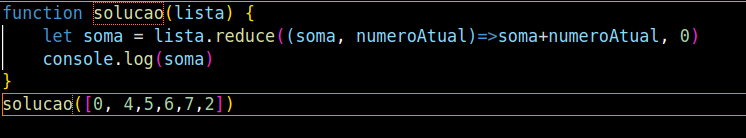

# Desafio lógica m01 b2b ifood t10

Esse desafio foi feito pelo hackerrank e possuia entradas aleatórias, para verificar os resultados basta chamar a função passando uma variavel e em sequencia o comando "node (nome da pasta)/index.js" no terminal, por exemplo:

